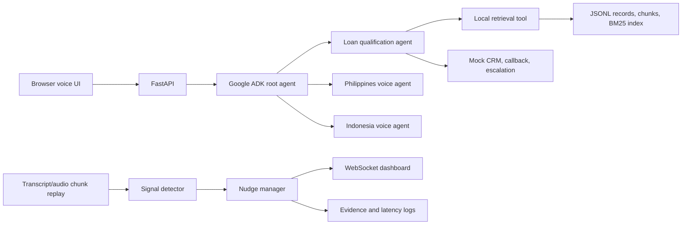

# AI Voice ADK Assessment

A free/local-first implementation of the AI Engineer assessment. Google ADK orchestrates four specialized agents; FastAPI supplies a browser voice interface and local dashboard; the knowledge base and nudge pipeline run locally.

## Assessment Coverage

| Question | Working deliverable | Evidence |
|---|---|---|
| Q1 | Knowledge-grounded small-business loan qualification agent with lead, callback, and escalation tools | `adk_app/agents/loan_qualification_agent.py`, `voice_configs/q1_business_loan_agent.md` |
| Q2 | Mixed-content KB pipeline with cleaning, normalization, PII redaction, chunking, local BM25, citations, and retrieval checks | `kb_builder/`, `knowledge_base/retrieval_report.md` |
| Q3 | Philippines insurance and Indonesia consumer-finance voice-agent configurations with language and register rules | `adk_app/agents/`, `voice_configs/`, `tests/test_philippines.py`, `tests/test_indonesia.py` |
| Q4 | Chunked real-time transcript replay, signal detection, nudge controls, dashboard WebSocket, and latency reporting | `realtime_nudges/`, `tests/test_nudges.py`, `evidence/latency_report.md` |

## Architecture



### Agent Architectures

- **Loan Qualification Agent (Q1)**: A specialized ADK agent focused on business loan origination. It is equipped with custom tools (`retrieve_kb` for BM25 local search, `crm_mock` for lead creation, and `escalate_human`) and strictly constrained to decline out-of-scope requests (like personal mortgages).
- **Philippines Voice Agent (Q3)**: A localized agent tailored for life insurance and bancassurance. It is instructed to fluidly code-switch between English, Tagalog, and Taglish, using natural finance terminology (e.g., *premium*, *rider*, *lapse*) while handling objections contextually for the Philippine market.
- **Indonesia Voice Agent (Q3)**: A localized consumer-finance agent. It handles both formal and colloquial Bahasa Indonesia, naturally incorporates English loanwords (like *down payment*), and gracefully manages regional dialect cues without breaking character.
- **Real-Time Nudge Agent (Q4)**: A high-speed, deterministic pipeline that analyzes streaming audio chunks. It bypasses the slower LLM loop for latency-critical tasks, using regex pattern matching and stateful cooldown/suppression rules to broadcast actionable JSON nudges via WebSockets.
- **Fallback System**: A safety layer using LangChain and Groq. If the primary Google API is exhausted, invalid, or fails, the system catches the error and seamlessly hot-swaps to a secondary Gemini model or Groq backup (`llama-3.3-70b-versatile`) to ensure zero-downtime conversation flow.

## Stack and Cost

- Google ADK and Gemini are the primary orchestration/model path.
- Browser Web Speech API provides microphone ASR and TTS where supported.
- Local JSONL plus BM25 provides retrieval; no vector database is required.
- FastAPI, WebSocket, and the mock CRM are local.
- The deterministic nudge pipeline works with no API key.
- LangChain + Groq can provide a fallback response path when the ADK/model call fails and `GROQ_API_KEY` is configured.
- Ollama can replace Gemini for a local model path after the adapter is configured.

## Quick Start

1. Create and activate a Python 3.11+ virtual environment.
2. Install dependencies: `python -m pip install -r requirements.txt`
3. Copy `.env.example` to `.env`; set `GOOGLE_API_KEY` for the primary ADK path and optionally set `GROQ_API_KEY` for the LangChain/Groq fallback.
4. Build the knowledge base: `python -m kb_builder.build_kb`
5. Run tests: `python -m pytest tests/ -v --tb=short`
6. Start the app: `python -m uvicorn web_app.main:app --reload --port 8000`
7. Open `http://127.0.0.1:8000`.

## Demo Commands

```powershell
python -m kb_builder.build_kb
python -m pytest tests/ -v --tb=short
python -m realtime_nudges.stream_replay all 1000
python -m realtime_nudges.latency_report
```

The replay command processes transcript chunks sequentially, simulating a live call. It detects cross-sell, disclosure, frustration, callback, and noisy-audio signals while applying confidence thresholds, cooldowns, duplicate suppression, priority, and expiry.

## Knowledge Base Design

The builder ingests eight mixed Markdown source files, strips navigation and boilerplate, removes near duplicates, normalizes terms/categories, flags and redacts PII, creates record-level metadata and chunks, then creates a local BM25 index. Every retrieval result includes `chunk_id`, `source_ref`, category, version, and PII state for citations and traceability.

## Evidence and Submission Notes

- Generated KB outputs are in `knowledge_base/`.
- Automated results and replay logs are in `evidence/logs/`.
- Demo call scripts are in `evidence/transcripts/`.
- Capture final browser-call recordings into `evidence/recordings/` before submitting. Do not use real customer data.
- See `docs/limitations.md` and `docs/production_improvements.md` for honest scope and next steps.

## Security

`.env`, recordings, generated caches, and local logs are ignored where appropriate. The source KB demonstrates PII redaction, and the agents are instructed not to collect sensitive identifiers or bank-account details in conversation.

python -m realtime_nudges.stream_replay cooperative 0.3 web http://127.0.0.1:8001/api/nudge-event