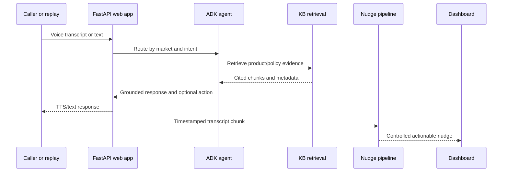

# Architecture and Data Flow

## Components

| Component | Responsibility | Assessment question |
|---|---|---|
| `kb_builder` | Ingests business documents, cleans noise, removes duplicates, normalizes data, redacts PII, chunks content, and builds BM25 | Q2 |
| `adk_app` | Google ADK root agent, specialized agents, grounded tools, and guard callbacks | Q1, Q3, Q4 |
| `web_app` | FastAPI endpoints, browser voice UI, market pages, dashboard, and WebSocket updates | Q1, Q3, Q4 |
| `realtime_nudges` | Replays timestamped chunks, finds call signals, controls nudge emission, and records latency | Q4 |
| `evidence` | Test outputs, transcripts, replay logs, latency report, and local recording destination | All |

## Request Flow

## Data Handling

1. Source files are parsed into section-level records with a deterministic record ID, source reference, category, source type, product, version, and effective date.
2. Cleaning removes navigation/footer comments and boilerplate. Near duplicates are evaluated through three-word shingles and Jaccard similarity.
3. The PII scanner redacts matched values and sets `contains_pii` so retrieval consumers can handle those records deliberately.
4. Each chunk preserves its parent record ID, source, version, category, and chunk position.
5. BM25 retrieval returns local evidence with `chunk_id` and `source_ref`; Q1 agents use it before answering business-policy questions.

## Failure Handling

- Missing KB index: retrieval returns a clear build instruction rather than inventing an answer.
- No relevant KB evidence: the loan agent offers human escalation.
- Incomplete or conflicting qualification details: the agent asks for clarification before qualification.
- Low-confidence, duplicate, cooldown-limited, or noisy segments: the nudge manager suppresses a nudge and logs the reason.
- ADK/model error: FastAPI returns an explicit error response and preserves the local route boundaries for investigation.
